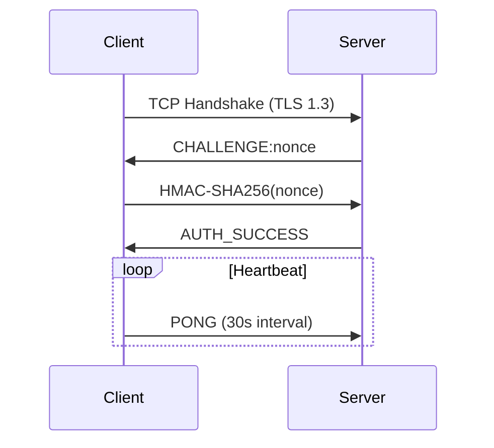
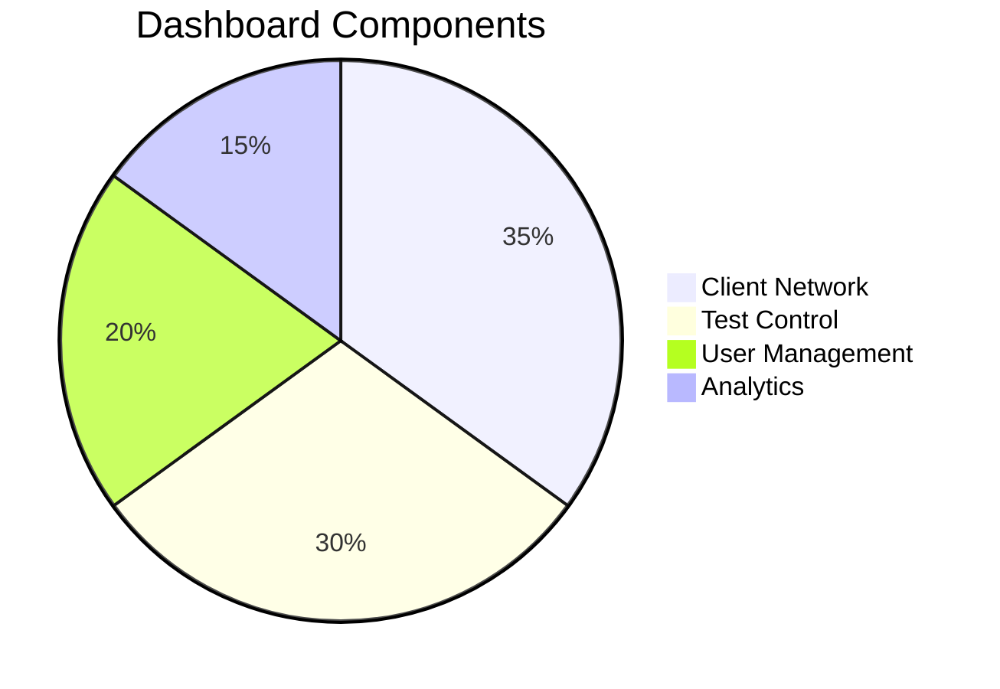
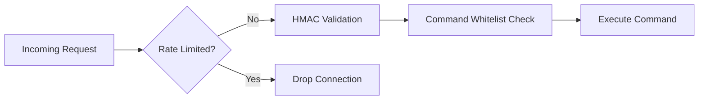

# Gostress-V2 C2 Framework

GostressV2: Just a simpler more chill, non-Tor version

> This does support Proxys like Original the [Gostress-Enhanced ](https://github.com/Birdo1221/Gostress-Enhanced)

## 📌 Overview

A robust command and control framework designed for authorized penetration testing and security research.

- **Encrypted TLS Communication** with client agents
- **Direct Secure Connection** with end-to-end encryption
- **Multi-user Role-Based Access Control**
- **Real-time Dashboard** with performance metrics
- **Multiple Network Testing Vectors** with adaptive rate limiting
- **Client Health Monitoring** with heartbeat system

The supplied User is `root:jDT38z7X82Ox`

> ⚠️ **Important**: This framework is intended solely for authorized security testing, educational purposes, and legitimate security research. Always obtain proper authorization before testing any system. Unauthorized use may violate laws and regulations.

| Startup | 
|---------|
|  | 

| Login | Dashboard |
|-------|----------|
|  |  |

| Users | Commands | Sys-Settings |
|-------|----------|--------------|
|  |  |  |

## 🔥 Features

### Core Architecture

- **Asynchronous Design**: Non-blocking I/O for 10,000+ concurrent clients
- **Modular Testing System**: Pluggable test modules with runtime validation
- **Ephemeral Clients**: Auto-cleanup of stale connections
- **HMAC Challenge-Response**: For client authentication



### Network Testing Capabilities

| Method | Layer | Description | Max Duration |
|--------|-------|-------------|--------------|
| UDP Test | 4 | High-volume UDP packet testing | 3600s |
| TCP Smart | 4 | Stateful TCP session analysis | 1800s |
| GRE Test | 3 | Protocol examination with GRE packets | 600s |
| HTTP Connection Test | 7 | Partial HTTP requests with keepalive | 300s |

### Security Features

- **Argon2id Password Hashing**: 128MB memory / 4 threads
- **JWT Authentication**: 15-minute expiry with refresh
- **CSRF Protection**: Per-session tokens
- **CSP Headers**: Strict Content Security Policy
- **IP Binding**: Optional client IP verification
- **Forward Secrecy**: TLS 1.3 with PFS cipher suites

## 🛠️ Installation

### Prerequisites

```bash
sudo apt install golang-go postgresql
```

### Setup

Generate certificates:
```bash
go run main.go -gencert
```

Configure the server:
```bash
# Edit config.json to set binding address, ports and security settings
nano config.json
```

## 🖥️ Dashboard Features



### Real-time Monitoring

- Client geographic distribution
- CPU/RAM utilization heatmap
- Network throughput graphs
- Packet loss metrics

### User Roles

| Role | Concurrent Tests | Methods Available | Duration Limit |
|------|-----------------|-------------------|---------------|
| Owner | 5 | All | 60 min |
| Admin | 5 | No UPDATE command | 30 min |
| Pro | 3 | Basic protocols | 10 min |
| Basic | 1 | UDP/TCP only | 5 min |

## ⚡ Quick Start

Start the server:
```bash
go build -o secure-c2 && ./secure-c2
```

Access via HTTPS:
```bash
curl -k https://localhost:443
```

Default credentials:
```
Username: root
Password: [generated during first run]
```

## 📊 Performance Metrics



```mermaid
gantt
    title Test Lifecycle
    dateFormat  HH:mm:ss
    section Client Network
    Connection Establishment :a1, 00:00:00, 5s
    Challenge Response      :a2, after a1, 3s
    section Test
    Command Propagation     :a3, 00:00:08, 2s
    Traffic Generation      :a4, after a3, 30s
```

- Throughput: 1.2M packets/sec per client
- Latency: <100ms command propagation (direct connection)
- Scalability: Tested with 5,000 concurrent clients

## 🔐 Enhanced Security Options

### Network Security Configuration

- **IP Allowlisting**: Restrict client connections by IP range
- **Connection Rate Limiting**: Prevent brute force attempts
- **TLS Certificate Pinning**: For verified client connections
- **Optional VPN Integration**: For additional security layer

### Defensive Measures



## 🚨 Legal & Ethical Considerations

This tool is provided for **educational and authorized security testing purposes only**. It is your responsibility to:

1. Obtain proper authorization before testing any system
2. Comply with all applicable laws and regulations
3. Use this tool only in environments you own or have explicit permission to test
4. Understand that the developers assume no liability for misuse

## 📜 License

GNU General Public License v3.0
